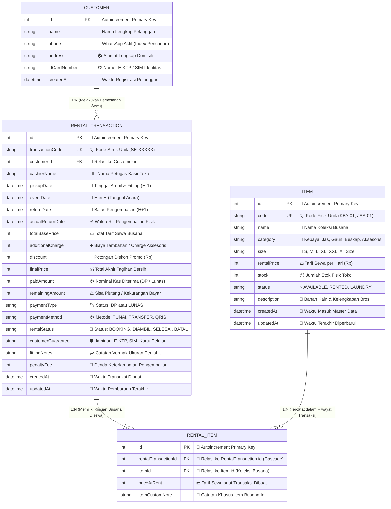
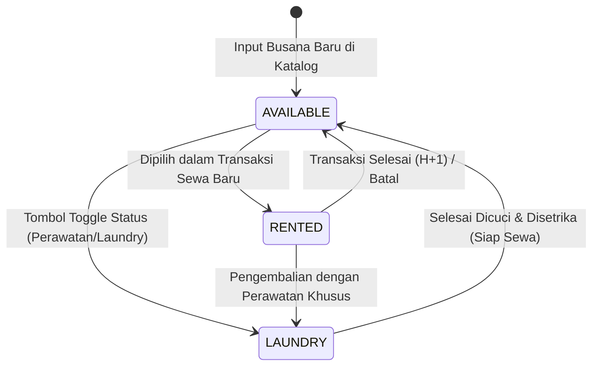
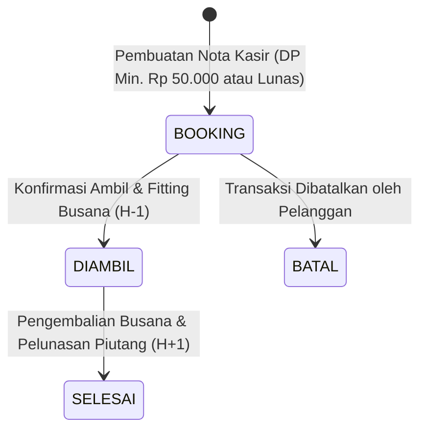

# 👘 SEWA AJA — Sistem Manajemen Persewaan Busana (Kebaya & Jas)
### Proyek Praktikum Hari Ke-2: Workshop PjBL SMK Telkom Lampung $\times$ Lampung Dev

Aplikasi web *server-side* berbasis **Node.js, Express.js, EJS (Server-Side Rendering), dan Prisma ORM dengan database SQLite**. Sistem ini mendigitalkan seluruh alur operasional persewaan busana tradisional, kebaya wisuda, gaun pengantin, jas formal pria, dan beskap adat — mulai dari katalog barang, manajemen stok, pencatatan transaksi sewa bersiklus **H-1 (Ambil & Fitting), Hari H (Pakai), dan H+1 (Kembali/Pulang)**, pencatatan catatan vermak penjahit, hingga pencetakan nota digital resmi.

---

## 🏗️ Tech Stack & Arsitektur Sistem

* **Runtime:** Node.js (v18+ / v20+ LTS / v24)
* **Framework Backend:** Express.js (v4.21+)
* **Template Engine:** EJS (*Embedded JavaScript*) dengan arsitektur MVC (*Model-View-Controller*)
* **Database:** SQLite (Mandiri dalam 1 berkas `prisma/dev.db` — *Zero-Config*, tanpa perlu XAMPP / MySQL)
* **Object-Relational Mapping (ORM):** Prisma ORM (`@prisma/client` v6+)
* **Database GUI Inspector:** Prisma Studio (`npx prisma studio`)
* **Styling Antarmuka:** Vanilla CSS modern bertema **Light Theme Bersih, Rapi & Profesional** dengan dukungan cetak nota (*print stylesheet*) serta **Modal Dialog Pencarian Interaktif**

---

## 📊 Desain Database & Arsitektur Relasi (ERD)

Sistem **"SEWA AJA"** mengadopsi standar perancangan basis data relasional industri yang modular, aman, dan efisien. Seluruh struktur tabel dan integritas data dikelola menggunakan **Prisma ORM** di atas engine **SQLite 3** (`prisma/dev.db`).

> [!NOTE]
> **Keunggulan Arsitektur SQLite + Prisma ORM untuk Pembelajaran Siswa:**
> * ⚡ **Zero-Configuration:** Seluruh basis data mandiri tersimpan dalam satu berkas `dev.db`. Siswa dan guru tidak perlu repot menyalakan Apache/MySQL di XAMPP yang sering mengalami konflik port.
> * 🛡️ **Type-Safe & Data Integrity:** Mencegah terjadinya *data orphan* (data yatim piatu) melalui relasi ketat `Foreign Key` dan `Cascade Deletion`.
> * 👁️ **Visual GUI Inspector:** Dilengkapi *Prisma Studio* bawaan (`npx prisma studio`) yang menyajikan antarmuka visual tabel menyerupai phpMyAdmin secara instan di port `5555`.

---

### 1. Diagram Relasi Entitas (Mermaid ERD)



---

### 2. Diagram Alur Relasi (ASCII Architecture)

Struktur tabel memecah relasi banyak-ke-banyak (*Many-to-Many*) antara transaksi dan busana menjadi dua relasi satu-ke-banyak (*One-to-Many*) melalui tabel perantara (*pivot table*) `RENTAL_ITEM`:

```text
┌─────────────────────────────────────────┐
│                CUSTOMER                 │
├─────────────────────────────────────────┤
│ 🔑 id (PK, Autoincrement)               │
│ 👤 name (String)                        │
│ 📱 phone (String, WhatsApp Index)       │
│ 🏠 address (String, Nullable)           │
│ 💳 idCardNumber (String, Nullable)      │
│ 📅 createdAt (DateTime)                 │
└────────────────────┬────────────────────┘
                     │ 1
                     │
                     │ melakukan sewa
                     │
                     │ 0..*
┌────────────────────▼──────────────────────────────────────────────────────────────┐
│                                RENTAL_TRANSACTION                                 │
├───────────────────────────────────────────────────────────────────────────────────┤
│ 🔑 id (PK, Autoincrement)                           📅 pickupDate (H-1 Fitting)   │
│ 🏷️  transactionCode (UK, Unique [SE-XXXXX])          🌟 eventDate (Hari H Acara)   │
│ 🔗 customerId (FK -> Customer.id)                   📅 returnDate (H+1 Batas)     │
│ 🧑‍💼 cashierName (String)                             ✅ actualReturnDate (Nullable)│
│ ─────────────────────────────────────────────────── ───────────────────────────── │
│ 💵 totalBasePrice (Int, Akumulasi Tarif)            🚦 rentalStatus (Status Sewa) │
│ ➕ additionalCharge (Int, Charge Aksesoris)         🛡️  customerGuarantee (Jaminan)│
│ ➖ discount (Int, Potongan Harga)                    ✂️  fittingNotes (Vermak)     │
│ 💰 finalPrice (Int, Tagihan Bersih)                 🚨 penaltyFee (Denda Telat)   │
│ 💳 paidAmount (Int, Kas Masuk DP/Lunas)             💳 paymentType [DP / LUNAS]   │
│ ⚠️ remainingAmount (Int, Sisa Piutang)              💳 paymentMethod [TUNAI/QRIS] │
└──────────────────────────────────────────┬────────────────────────────────────────┘
                                           │ 1
                                           │
                                           │ memiliki rincian busana (onDelete: Cascade)
                                           │
                                           │ 1..*
┌─────────────────────────────────────────┐│┌───────────────────────────────────────┐
│                  ITEM                   │││              RENTAL_ITEM              │
├─────────────────────────────────────────┤│├───────────────────────────────────────┤
│ 🔑 id (PK, Autoincrement)               │││ 🔑 id (PK, Autoincrement)             │
│ 🏷️  code (UK, Unique [KBY-01, JAS-01])   │└┼─► 🔗 rentalTransactionId (FK, Cascade)│
│ 👗 name (String)                        │ │ 🔗 itemId (FK -> Item.id)             │
│ 📂 category (Kebaya, Jas, Gaun, Beskap) │ 1 💵 priceAtRent (Int, Snap Historis)   │
│ 📏 size (S, M, L, XL, XXL, All Size)    │◄──┤ 📝 itemCustomNote (String, Nullable)│
│ 💵 rentalPrice (Int, Tarif Sewa/Hari)   │   └───────────────────────────────────────┘
│ 📦 stock (Int, Jumlah Fisik)            │     (Pivot Table Pemecah Relasi M : N)
│ ⚡ status [AVAILABLE/RENTED/LAUNDRY]    │
└─────────────────────────────────────────┘
```

---

### 3. Matriks Kardinalitas Relasi & Aturan Integritas

| Tabel Asal | Simbol | Tabel Tujuan | Kunci Penghubung (*Foreign Key*) | Aturan Hapus (*On Delete*) | Deskripsi Makna Bisnis |
| :--- | :---: | :--- | :--- | :---: | :--- |
| **`Customer`** | `1 : N` | **`RentalTransaction`** | `RentalTransaction.customerId` $\rightarrow$ `Customer.id` | `Restrict` | Satu pelanggan dapat memiliki banyak riwayat persewaan. Data pelanggan terlindungi dari penghapusan selama memiliki transaksi sewa. |
| **`RentalTransaction`** | `1 : N` | **`RentalItem`** | `RentalItem.rentalTransactionId` $\rightarrow$ `RentalTransaction.id` | **`Cascade`** | Satu nota sewa dapat memuat 1 atau banyak busana sekaligus. Jika transaksi dihapus, rincian item di dalamnya otomatis ikut terhapus secara bersih. |
| **`Item`** | `1 : N` | **`RentalItem`** | `RentalItem.itemId` $\rightarrow$ `Item.id` | `Restrict` | Satu model busana dapat tercatat pada banyak transaksi sewa. Master busana **dilarang dihapus** jika sedang berada dalam masa sewa aktif. |

---

### 4. Diagram Alur Status (*State Machine Lifecycle*)

#### A. Siklus Ketersediaan Busana Fisik (`Item.status`)


#### B. Siklus Alur Transaksi Persewaan (`RentalTransaction.rentalStatus`)


---

### 5. Rumus & Otomatisasi Perhitungan Bisnis Kasir

Sistem menerapkan validasi matematika dan penanggalan terotomatisasi secara instan:

```text
┌────────────────────────────────────────────────────────────────────────────────────────┐
│                        FORMULA PERHITUNGAN OPERASIONAL KASIR                           │
├────────────────────────────────────────────────────────────────────────────────────────┤
│ 1. Tagihan Bersih  : finalPrice      = totalBasePrice + additionalCharge - discount    │
│ 2. Sisa Piutang    : remainingAmount = finalPrice - paidAmount                         │
│ 3. Status Bayar    : remainingAmount == 0 ? "LUNAS" : "DP (Uang Muka Min. Rp 50.000)" │
│ 4. Jadwal Ambil    : pickupDate      = eventDate - 1 Hari  (H-1 Fitting di Toko)       │
│ 5. Batas Kembali   : returnDate      = eventDate + 1 Hari  (H+1 Pulang Busana)         │
│ 6. Denda Telat     : penaltyFee      = telatHari * tarifDendaHarian                    │
└────────────────────────────────────────────────────────────────────────────────────────┘
```

---

### 6. Kamus Data & Spesifikasi Kolom Tabel (*Data Dictionary*)

Berikut rincian spesifikasi teknis dari setiap tabel yang tersimpan di dalam SQLite (`prisma/dev.db`):

#### 👗 Tabel 1: `Item` (Master Katalog Busana)
Menyimpan data inventaris seluruh busana tradisional, kebaya wisuda, gaun pengantin, jas formal pria, beskap adat, dan aksesoris.

| Nama Kolom | Tipe Data | Kunci / Atribut | Nilai Bawaan (*Default*) | Deskripsi Bisnis & Contoh Nilai |
| :--- | :---: | :---: | :---: | :--- |
| `id` | `Int` | <kbd>PK</kbd> <kbd>Auto</kbd> | *Otomatis* | ID unik busana di sistem. |
| `code` | `String` | <kbd>UNIQUE</kbd> | - | Kode fisik barcode/label busana *(Contoh: `KBY-01`, `JAS-02`, `GUN-01`)*. |
| `name` | `String` | - | - | Nama lengkap busana *(Contoh: `Kebaya Brokat Maroon Modern`)*. |
| `category` | `String` | - | - | Klasifikasi busana: `Kebaya`, `Jas Formal`, `Gaun Pengantin`, `Beskap Adat`, `Aksesoris`. |
| `size` | `String` | - | `'All Size'` | Ukuran busana: `S`, `M`, `L`, `XL`, `XXL`, `All Size`. |
| `rentalPrice`| `Int` | - | - | Tarif sewa per hari dalam mata uang Rupiah *(Contoh: `150000`)*. |
| `stock` | `Int` | - | `1` | Jumlah stok fisik yang tersedia di galeri toko. |
| `status` | `String` | - | `'AVAILABLE'` | Status operasional barang: `AVAILABLE` (Tersedia), `RENTED` (Disewa), `LAUNDRY` (Perawatan). |
| `description`| `String?` | <kbd>NULL</kbd> | `null` | Keterangan bahan kain, warna dominan, atau kelengkapan bros/selayer. |
| `createdAt` | `DateTime`| - | `now()` | Waktu item pertama kali didaftarkan ke sistem. |
| `updatedAt` | `DateTime`| - | *Otomatis* | Waktu pembaruan informasi item terakhir kali. |

---

#### 👤 Tabel 2: `Customer` (Data Pelanggan / Penyewa)
Menyimpan data identitas penyewa untuk mempermudah riwayat peminjaman berulang.

| Nama Kolom | Tipe Data | Kunci / Atribut | Nilai Bawaan | Deskripsi Bisnis & Contoh Nilai |
| :--- | :---: | :---: | :---: | :--- |
| `id` | `Int` | <kbd>PK</kbd> <kbd>Auto</kbd> | *Otomatis* | ID unik pelanggan. |
| `name` | `String` | - | - | Nama lengkap pelanggan *(Contoh: `Siti Nurhaliza`)*. |
| `phone` | `String` | Index | - | Nomor kontak WhatsApp aktif *(Contoh: `0812-7890-1234`)*. |
| `address` | `String?` | <kbd>NULL</kbd> | `null` | Alamat domisili pelanggan *(Contoh: `Jl. ZA Pagar Alam No. 45, Kedaton`)*. |
| `idCardNumber`| `String?` | <kbd>NULL</kbd> | `null` | Nomor identitas resmi pada kartu jaminan *(Contoh: `1871012345670001`)*. |
| `createdAt` | `DateTime` | - | `now()` | Tanggal pertama kali pelanggan menyewa. |

---

#### 📑 Tabel 3: `RentalTransaction` (Transaksi Persewaan Utama)
Menyimpan data transaksi persewaan, jadwal operasional **H-1, Hari H, H+1**, informasi keuangan (DP & sisa piutang), jaminan fisik, dan catatan vermak penjahit.

| Nama Kolom | Tipe Data | Kunci / Atribut | Nilai Bawaan | Deskripsi Bisnis & Contoh Nilai |
| :--- | :---: | :---: | :---: | :--- |
| `id` | `Int` | <kbd>PK</kbd> <kbd>Auto</kbd> | *Otomatis* | ID transaksi di database. |
| `transactionCode` | `String` | <kbd>UNIQUE</kbd> | - | Kode unik struk sewa *(Contoh: `SE-82383`, `SE-59053`)*. |
| `customerId` | `Int` | <kbd>FK</kbd> $\rightarrow$ `Customer.id` | - | Relasi ke penyewa yang bersangkutan. |
| `cashierName` | `String` | - | `'Seli (Kasir)'` | Nama staf kasir yang melayani pembuatan nota. |
| `pickupDate` | `DateTime` | - | - | **Tanggal Ambil (H-1):** Pelanggan mengambil busana untuk fitting akhir di toko. |
| `eventDate` | `DateTime` | - | - | **Hari H (Tanggal Pakai):** Tanggal acara wisuda, pernikahan, atau pesta. |
| `returnDate` | `DateTime` | - | - | **Batas Pengembalian (H+1):** Batas maksimal busana dikembalikan ke toko. |
| `actualReturnDate`| `DateTime?` | <kbd>NULL</kbd> | `null` | Waktu pengembalian fisik busana secara riil oleh pelanggan. |
| `totalBasePrice` | `Int` | - | - | Akumulasi harga tarif sewa busana yang dipilih. |
| `additionalCharge`| `Int` | - | `0` | Biaya tambahan untuk sewa aksesoris ekstra, dasi, atau bros *(Contoh: `15000`)*. |
| `discount` | `Int` | - | `0` | Potongan harga promo atau langganan *(Contoh: `10000`)*. |
| `finalPrice` | `Int` | - | - | **Tagihan Bersih:** `(totalBasePrice + additionalCharge - discount)`. |
| `paidAmount` | `Int` | - | - | Nominal yang telah dibayarkan oleh pelanggan ke kasir. |
| `remainingAmount`| `Int` | - | - | **Sisa Piutang:** `(finalPrice - paidAmount)`. Bernilai `0` jika Lunas. |
| `paymentType` | `String` | - | `'DP'` | Status bayar kasir: `DP` (Uang Muka $\ge$ Rp 50.000) atau `LUNAS`. |
| `paymentMethod` | `String` | - | `'TUNAI'` | Metode bayar yang digunakan: `TUNAI`, `TRANSFER`, atau `QRIS`. |
| `rentalStatus` | `String` | - | `'BOOKING'` | Status alur: `BOOKING` $\rightarrow$ `DIAMBIL` $\rightarrow$ `SELESAI` (atau `BATAL`). |
| `customerGuarantee`| `String` | - | `'E-KTP'` | Dokumen fisik yang ditahan toko: `E-KTP`, `SIM`, `Kartu Pelajar`. |
| `fittingNotes` | `String?` | <kbd>NULL</kbd> | `null` | **Catatan Vermak:** Instruksi penjahit *(Contoh: `"Jas dikecilkan 2 cm di pinggang"`)*. |
| `penaltyFee` | `Int` | - | `0` | Denda keterlambatan jika busana dikembalikan melewati batas tanggal `returnDate`. |
| `createdAt` | `DateTime` | - | `now()` | Waktu transaksi dibuat dan nota diterbitkan. |
| `updatedAt` | `DateTime` | - | *Otomatis* | Waktu pembaruan informasi transaksi terakhir kali. |

---

#### 🔗 Tabel 4: `RentalItem` (Rincian Busana / Pivot Relasi N:M)
Menghubungkan transaksi sewa dengan satu atau banyak busana (*Many-to-Many Relationship*).

| Nama Kolom | Tipe Data | Kunci / Atribut | Nilai Bawaan | Deskripsi Bisnis & Aturan Integritas |
| :--- | :---: | :---: | :---: | :--- |
| `id` | `Int` | <kbd>PK</kbd> <kbd>Auto</kbd> | *Otomatis* | ID baris rincian sewa. |
| `rentalTransactionId` | `Int` | <kbd>FK</kbd> $\rightarrow$ `RentalTransaction.id` | - | ID transaksi induk. Dilengkapi aturan **`onDelete: Cascade`** *(jika transaksi dihapus, rincian otomatis terhapus)*. |
| `itemId` | `Int` | <kbd>FK</kbd> $\rightarrow$ `Item.id` | - | ID busana fisik yang disewa. Dilengkapi aturan **`onDelete: Restrict`**. |
| `priceAtRent` | `Int` | - | - | Tarif sewa busana saat transaksi dibuat (mengamankan data historis jika harga master berubah). |
| `itemCustomNote` | `String?` | <kbd>NULL</kbd> | `null` | Catatan khusus untuk busana tertentu *(misal: `"Termasuk sarung cover hitam"`)*. |

---

### 7. Aturan Integritas & Logika Bisnis Database (*Business Rules*)

1. **Siklus Status Ketersediaan Busana (*State Transition*):**
   * Saat busana dimasukkan ke dalam transaksi sewa baru $\rightarrow$ status `Item` otomatis berubah menjadi **`RENTED`** (*Sedang Disewa*).
   * Busana berstatus `RENTED` otomatis disembunyikan dari pilihan transaksi sewa baru untuk mencegah **Double Booking**.
   * Saat transaksi diselesaikan melalui menu pengembalian kasir (**`SELESAI`**) atau dibatalkan (**`BATAL`**) $\rightarrow$ status `Item` otomatis kembali pulih menjadi **`AVAILABLE`** (*Tersedia*).
2. **Aturan Keuangan & DP Kasir:**
   * Pembayaran awal (*paidAmount*) di kasir wajib minimal **Rp 50.000** atau lunas.
   * Jika `remainingAmount == 0`, maka `paymentType` otomatis tercatat sebagai **`LUNAS`**.
   * Jika `remainingAmount > 0`, maka `paymentType` tercatat sebagai **`DP`** dan kasir dapat melunasinya kapan saja melalui tombol *Lunasi Sisa Tagihan*.
3. **Proteksi Integritas Referensial (*Referential Protection*):**
   * Busana yang sedang terikat dalam transaksi berstatus `BOOKING` atau `DIAMBIL` **TIDAK DAPAT DIHAPUS** dari katalog untuk menjaga akurasi laporan keuangan dan pencegahan *data orphan*.
4. **Deteksi Otomatis Keterlambatan Pengembalian (*Overdue Detection*):**
   * Sistem secara otomatis membandingkan tanggal hari ini (`today`) dengan `returnDate`. Jika status masih `DIAMBIL` dan telah melewati H+1, sistem menampilkan badge peringatan berkedip: `⚠️ TELAT KEMBALI` serta mengaktifkan kolom input denda pada nota pengembalian.

---

### 8. Kode Skema Prisma Lengkap (`prisma/schema.prisma`)

Berikut kode sumber skema resmi yang digunakan pada proyek:

```prisma
generator client {
  provider = "prisma-client-js"
}

datasource db {
  provider = "sqlite"
  url      = env("DATABASE_URL")
}

// 1. Model Katalog Busana (Kebaya, Jas Formal, Gaun, Beskap, Aksesoris)
model Item {
  id          Int          @id @default(autoincrement())
  code        String       @unique // Contoh: KBY-01, JAS-01
  name        String       // Contoh: Kebaya Brokat Maroon Modern
  category    String       // Kebaya, Jas Formal, Gaun Pengantin, Beskap Adat, Aksesoris
  size        String       @default("All Size") // S, M, L, XL, All Size
  rentalPrice Int          // Harga sewa per hari (Rp)
  stock       Int          @default(1)
  status      String       @default("AVAILABLE") // AVAILABLE, RENTED, LAUNDRY, MAINTENANCE
  description String?      // Keterangan bahan, warna, kelengkapan
  createdAt   DateTime     @default(now())
  updatedAt   DateTime     @updatedAt
  rentalItems RentalItem[]
}

// 2. Model Data Pelanggan / Penyewa
model Customer {
  id           Int                 @id @default(autoincrement())
  name         String
  phone        String
  address      String?
  idCardNumber String?             // Nomor KTP / SIM Jaminan
  createdAt    DateTime            @default(now())
  rentals      RentalTransaction[]
}

// 3. Model Transaksi Persewaan Busana
model RentalTransaction {
  id                Int          @id @default(autoincrement())
  transactionCode   String       @unique // Contoh: SE-82383
  customerId        Int
  customer          Customer     @relation(fields: [customerId], references: [id])
  cashierName       String       @default("Seli (Kasir)")
  pickupDate        DateTime     // Tanggal Ambil (H-1)
  eventDate         DateTime     // Hari H (Tanggal Pakai)
  returnDate        DateTime     // Tanggal Pulang / Kembali (H+1)
  actualReturnDate  DateTime?    // Tanggal pengembalian riil oleh pelanggan
  totalBasePrice    Int          // Total tarif sewa busana
  additionalCharge  Int          @default(0) // Biaya charge / aksesoris tambahan
  discount          Int          @default(0) // Diskon promo (Rp)
  finalPrice        Int          // Total tagihan akhir
  paidAmount        Int          // Nominal dibayar (DP minimal Rp 50.000 atau Lunas)
  remainingAmount   Int          // Sisa tagihan / kekurangan (Rp)
  paymentType       String       @default("DP") // DP, LUNAS
  paymentMethod     String       @default("TUNAI") // TUNAI, TRANSFER, QRIS
  rentalStatus      String       @default("BOOKING") // BOOKING, DIAMBIL, SELESAI, BATAL, TERLAMBAT
  customerGuarantee String       @default("E-KTP") // E-KTP, SIM, KTP Pelajar
  fittingNotes      String?      // Catatan vermak/ukuran: "Jas dikecilin 3 cm di pinggang..."
  penaltyFee        Int          @default(0) // Denda keterlambatan jika lewat returnDate
  createdAt         DateTime     @default(now())
  updatedAt         DateTime     @updatedAt
  rentalItems       RentalItem[]
}

// 4. Model Rincian Busana dalam Transaksi (Pivot Relation)
model RentalItem {
  id                  Int               @id @default(autoincrement())
  rentalTransactionId Int
  rentalTransaction   RentalTransaction @relation(fields: [rentalTransactionId], references: [id], onDelete: Cascade)
  itemId              Int
  item                Item              @relation(fields: [itemId], references: [id])
  priceAtRent         Int               // Harga sewa pada saat transaksi dibuat
  itemCustomNote      String?           // Catatan khusus item ini
}
```

---

## 📁 Struktur Folder Proyek

```text
project-day-2/
├── prisma/
│   ├── schema.prisma          # Skema model ORM (Item, Customer, RentalTransaction, RentalItem)
│   ├── dev.db                 # Berkas database lokal SQLite (otomatis terbentuk)
│   └── seed.js                # Skrip pembuat data dummy awal yang realistis
│
├── public/
│   ├── css/
│   │   └── style.css          # Desain antarmuka light theme modern & print invoice CSS
│   └── js/
│       └── main.js            # Skrip kalkulator harga, tanggal H-1/H/H+1 & Modal Cari Barang
│
├── src/
│   ├── config/
│   │   └── db.js              # Inisialisasi koneksi Prisma Client singleton
│   ├── controllers/
│   │   ├── dashboard.controller.js  # Rekap statistik stok, omset kas, & keterlambatan
│   │   ├── item.controller.js       # Operasi CRUD katalog busana & filter kategori
│   │   └── rental.controller.js     # Logika transaksi sewa, DP, pelunasan, & pengembalian
│   ├── routes/
│   │   ├── index.routes.js    # Rute utama dashboard (/)
│   │   ├── item.routes.js     # Rute katalog busana (/items)
│   │   └── rental.routes.js   # Rute transaksi sewa (/rentals)
│   └── server.js              # Entry point utama Express dengan auto-port fallback
│
├── views/
│   ├── partials/
│   │   ├── header.ejs         # Navigasi atas, tombol CTA sewa, & badge status server
│   │   └── footer.ejs         # Footer hak cipta workshop & portal tugas
│   ├── dashboard.ejs          # Tampilan dashboard metrik & 5 transaksi terbaru
│   ├── items/
│   │   ├── index.ejs          # Tabel katalog busana, pencarian, & filter status
│   │   ├── create.ejs         # Formulir tambah busana baru
│   │   └── edit.ejs           # Formulir perbarui busana
│   └── rentals/
│       ├── index.ejs          # Daftar transaksi sewa aktif & deteksi telat kembali
│       ├── create.ejs         # Form kasir sewa (Modal Cari Barang, DP, jaminan, vermak)
│       └── detail.ejs         # Nota struk digital resmi siap cetak (window.print)
│
├── .env                       # Konfigurasi PORT & DATABASE_URL
├── .env.example               # Template berkas environment
├── .gitignore                 # Berkas yang diabaikan Git (node_modules, dev.db)
├── package.json               # Daftar pustaka & skrip runner
└── README.md                  # Dokumentasi panduan instalasi & pengujian lokal
```

---

## 🚀 Langkah Menjalankan Proyek di Lokal

Ikuti langkah demi langkah berikut di komputer / laptop Anda:

### 1. Masuk ke Folder Proyek
Buka terminal (Terminal VS Code, CMD, PowerShell, atau Git Bash), lalu arahkan ke folder `project-day-2`:
```bash
cd project-day-2
```

### 2. Pasang Semua Dependensi (*Install Packages*)
Jalankan perintah berikut untuk mengunduh Express, EJS, Prisma, dan dependensi lainnya:
```bash
npm install
```

### 3. Buat File Konfigurasi `.env`
Salin template berkas `.env.example` menjadi `.env` (atau buat file `.env` baru):
```bash
# Isi berkas .env:
PORT=3002
DATABASE_URL="file:./dev.db"
```
*(Catatan: Proyek ini secara otomatis memiliki fitur **Auto Port Fallback** jika port yang dipilih sedang dipakai oleh aplikasi lain).*

### 4. Sinkronisasikan Skema Database SQLite
Jalankan perintah Prisma db push untuk membuat database `dev.db` dan seluruh tabel relasionalnya secara otomatis:
```bash
npm run prisma:push
```

### 5. Masukkan Data Awal (*Seeding Database*)
Jalankan skrip *seeder* bawaan untuk mengisi 12 busana populer (kebaya, jas tuxedo, gaun pengantin, beskap adat, aksesoris), data pelanggan, dan 2 transaksi sewa aktif acuan modul:
```bash
npm run seed
```
*Output yang muncul:*
```text
🌱 Memulai proses seeding data awal SEWA AJA...
✅ Berhasil menambahkan 12 koleksi busana.
✅ Berhasil menambahkan 3 data pelanggan awal.
✅ Berhasil menambahkan 2 transaksi sewa aktif: SE-82383 & SE-82384
🎉 Seeding database selesai! Database siap digunakan.
```

### 6. Jalankan Server Aplikasi
Jalankan server dalam mode pengembangan (*auto-reload* menggunakan `nodemon`):
```bash
npm run dev
```
Atau jika ingin menjalankan menggunakan Node biasa:
```bash
npm start
```

### 7. Buka Aplikasi di Browser
Buka browser favorit Anda (Google Chrome / Microsoft Edge / Mozilla Firefox), lalu akses alamat:
👉 **[http://localhost:3002](http://localhost:3002)**
*(Jika port 3002 terpakai, perhatikan pesan di terminal untuk melihat nomor port alternatif yang digunakan).*

---

## 🧪 Panduan Menguji Semua Fitur (Step-by-Step Walkthrough)

Berikut skenario pengujian komprehensif untuk mendemonstrasikan seluruh fitur sistem kepada siswa atau dewan penguji:

### 📊 Fitur 1: Dashboard Operasional & Statistik Real-Time
1. Buka halaman utama: `http://localhost:3002/`.
2. **Amati 4 Kartu Metrik:**
   * **Total Koleksi Busana:** Jumlah total item, item yang siap disewa, dan item yang sedang keluar.
   * **Sewa Aktif:** Jumlah transaksi berstatus `BOOKING` atau `DIAMBIL`.
   * **Kas Masuk (Omset):** Total perputaran uang tunai/transfer dari pembayaran DP dan pelunasan.
   * **Sisa Piutang:** Sisa kekurangan tagihan pelanggan yang belum dilunasi.
3. **Peringatan Keterlambatan (*Overdue Alert*):** Jika ada barang berstatus `DIAMBIL` yang melewati tanggal H+1, sistem menampilkan *alert* merah dengan tautan langsung ke transaksi tersebut.
4. **Tabel Transaksi Terbaru:** Menampilkan 5 transaksi sewa terakhir dengan tombol cepat ke nota bukti sewa.

---

### 👗 Fitur 2: Katalog Koleksi Busana (CRUD Lengkap)
1. Klik menu **"👗 Cek Barang (Katalog)"** di navbar atas (`http://localhost:3002/items`).
2. **Pencarian Cepat:** Ketik kata kunci pada kotak pencarian (misal: `maroon` atau `JAS-01`), lalu tekan Enter.
3. **Filter Kategori & Status:**
   * Pilih dropdown Kategori (misal: `Kebaya`, `Jas Formal`, `Gaun Pengantin`).
   * Pilih dropdown Status (misal: `Tersedia (Ready)`, `Sedang Disewa`, `Dalam Perawatan / Laundry`).
4. **Tambah Busana Baru:**
   * Klik tombol **"➕ Tambah Koleksi Baru"**.
   * Isi kode busana unik (contoh: `KBY-05`), nama (contoh: `Kebaya Wisuda Payet Lilac`), kategori, ukuran, tarif sewa (contoh: `160000`), dan keterangan bahan.
   * Klik **"Simpan Busana ke Katalog"**. Sistem otomatis menyimpan data ke SQLite dan menampilkan notifikasi sukses hijau.
5. **Ubah Status Cepat (Toggle Status):**
   * Klik tombol **"🔄 Status"** pada salah satu busana. Status akan otomatis berganti antara `Tersedia` dan `Laundry`.
6. **Edit & Hapus Busana:**
   * Klik tombol **"✏️ Edit"** untuk memperbarui tarif atau ukuran.
   * Klik tombol **"🗑️"** untuk menghapus. *Catatan Keamanan Industri: Busana yang sedang terikat dalam transaksi sewa aktif TIDAK BISA dihapus untuk menjaga integritas data keuangan!*

---

### 👘 Fitur 3: Transaksi Persewaan Baru ("SEWA AJA") & Modal Cari Barang
Fitur ini mensimulasikan antarmuka kasir toko busana profesional dengan sistem pemilihan barang yang modern:
1. Klik tombol **"➕ Transaksi Sewa Baru"** di navbar (`http://localhost:3002/rentals/new`).
2. **Identitas Pelanggan:**
   * Masukkan Nama Pelanggan (contoh: `Anisa Rahmawati`).
   * Masukkan Nomor WhatsApp (contoh: `0812-9988-7766`).
   * Masukkan Nomor E-KTP / SIM dan pilih dokumen fisik jaminan (`E-KTP Asli`).
3. **Siklus Tanggal (H-1, Hari H, H+1):**
   * Tentukan **Hari H (Tanggal Acara)**.
   * Perhatikan bahwa **Tanggal Ambil (H-1)** dan **Tanggal Pulang (H+1)** akan otomatis terhitung dan terisi sendiri oleh JavaScript!
4. **Tombol "🔍 Cari Barang" & Modal Interaktif:**
   * Klik tombol **"🔍 Cari Barang"**. Muncul jendela modal popup dengan *backdrop blur*.
   * Gunakan kotak pencarian di modal untuk mencari busana secara instan *(misal ketik `tuxedo` atau `brokat`)* atau pilih filter dropdown kategori.
   * Centang busana yang diinginkan, amati jumlah counter di bawah modal, lalu klik **"✅ Gunakan Busana Terpilih"**.
   * Busana terpilih langsung tampil rapi dalam tabel daftar barang lengkap dengan tombol *Hapus* per baris dan live calculator total tarif.
5. **Catatan Vermak / Fitting Ukuran:**
   * Tuliskan instruksi penjahit pada kotak catatan (contoh: *"Jas dikecilkan 2 cm di lengan, kancing kebaya nomor 1 diganti"*).
6. **Pembayaran Kasir:**
   * Masukkan biaya tambahan / *charge* (jika ada, misal sewa dasi ekstra: `15000`).
   * Masukkan potongan diskon (jika ada: `10000`).
   * Masukkan nominal pembayaran kasir (aturan bisnis: **minimal DP Rp 50.000** atau lunas).
   * Pilih metode bayar: `Tunai / Cash`, `Transfer Bank`, atau `QRIS`.
7. Klik **"💾 Simpan Transaksi & Cetak Nota"**. Sistem otomatis:
   * Menyimpan transaksi ke SQLite.
   * Mengubah status busana yang dipilih menjadi `RENTED` (*Sedang Disewa*).
   * Mengarahkan kasir langsung ke halaman cetak nota struk digital!

---

### 📋 Fitur 4: Cek Sewaan, Pengambilan, Pelunasan & Pengembalian
1. Klik menu **"📋 Cek Sewaan"** di navbar (`http://localhost:3002/rentals`).
2. Seluruh transaksi tampil lengkap dengan badge status (`BOOKING`, `DIAMBIL`, `SELESAI`, `BATAL`).
3. Klik tombol **"🔍 Nota & Aksi"** pada salah satu transaksi untuk membuka panel operasional kasir:
   * **Tahap 1 (Saat H-1):** Pelanggan datang mengambil busana $\rightarrow$ Klik tombol hijau **"👘 Konfirmasi Pengambilan Busana (H-1)"**. Status berubah menjadi `DIAMBIL`.
   * **Tahap 2 (Pelunasan Piutang):** Pelanggan melunasi sisa tagihan $\rightarrow$ Klik tombol biru **"💵 Lunasi Sisa Tagihan"**. Status pembayaran berubah menjadi `LUNAS`.
   * **Tahap 3 (Saat H+1):** Pelanggan mengembalikan busana $\rightarrow$ Masukkan denda keterlambatan (jika telat) $\rightarrow$ Klik tombol **"✅ Pengembalian Selesai (H+1)"**.
   * *Otomatisasi Sistem:* Status transaksi berubah menjadi `SELESAI`, dan seluruh busana yang disewa otomatis kembali berstatus `AVAILABLE` (*Tersedia*) di katalog!

---

### 🖨️ Fitur 5: Cetak Langsung ke Printer Thermal Bluetooth (Web Bluetooth API & ESC/POS)
1. Buka halaman detail transaksi sewa (`http://localhost:3002/rentals/:id`).
2. **Panel Koneksi Printer Bluetooth & Indikator Status:**
   * Di atas struk, tersedia panel khusus **Koneksi Printer Thermal Bluetooth** lengkap dengan lampu indikator status:
     * ⚪ **Belum Terkoneksi (Siap Pairing):** Printer siap dipasangkan.
     * 🟡 **Menghubungkan:** Dialog pemilih Bluetooth browser terbuka untuk memilih printer Anda.
     * 🟢 **Terkoneksi:** Terhubung langsung ke printer thermal fisik *(contoh: Panda, Eppos, Iware, Zywell, PT-210, MPT-II)*.
     * 🟣 **Memproses Cetak:** Sistem sedang menyusun byte data **ESC/POS** dan mengirimkannya secara chunked via GATT Bluetooth.
     * ✅ **Cetak Sukses:** Notifikasi hijau menandakan seluruh data struk telah diterima printer.
3. **Pilihan Metode Cetak:**
   * **📶 Hubungkan & Cetak Bluetooth:** Mengirim data raw ESC/POS langsung ke printer thermal tanpa popup dialog print OS.
   * **🖨️ Cetak Standar (Browser/USB):** Menggunakan dialog print bawaan sistem operasi / browser.
   * **🧪 Demo Simulasi Cetak:** Mode simulasi interaktif untuk presentasi atau pengujian kelas jika siswa/guru tidak membawa perangkat printer fisik.
4. **Pilihan Format & Lebar Kertas:**
   * **Lebar Kertas:** Pilihan antara ukuran **80 mm (Standar POS)** atau **58 mm (Mini Bluetooth Portable)**.
   * **Mode Switcher:** Tersedia tombol beralih cepat antara **🧾 Struk Thermal (Bluetooth)** dan **📄 Faktur Lebar (A4)**.

---

### 🗃️ Fitur 6: Visual Database Inspector (Prisma Studio)
Untuk melihat dan mengelola isi tabel SQLite secara visual persis seperti phpMyAdmin:
1. Buka terminal baru di folder `project-day-2`.
2. Jalankan perintah:
   ```bash
   npm run prisma:studio
   ```
3. Buka browser di alamat: **`http://localhost:5555`**.
4. Anda dapat melihat seluruh tabel (`Item`, `Customer`, `RentalTransaction`, `RentalItem`), mengedit kolom data secara langsung, dan mengecek relasi antar tabel!

---

## ❓ Panduan Pemecahan Masalah (Troubleshooting)

| Gejala Error | Penyebab | Solusi Cepat |
| :--- | :--- | :--- |
| **`Error: listen EADDRINUSE :::3000`** | Port sedang dipakai server lain. | Tenang! Server ini sudah dilengkapi *Auto Port Fallback* dan otomatis mencoba port 3002, 3003, dst. Anda juga bisa mengganti nilai `PORT` di file `.env`. |
| **`Cannot find module '@prisma/client'`** | Pustaka Prisma belum ter-generate. | Jalankan perintah: `npm run prisma:push` atau `npx prisma generate`. |
| **Database masih kosong setelah install** | Belum menjalankan skrip seeder. | Jalankan perintah: `npm run seed`. |
| **Perubahan CSS atau tampilan EJS tidak terlihat** | Browser menyimpan file cache lama. | Tekan tombol shortcut keyboard **`Ctrl + Shift + R`** (Windows) atau **`Cmd + Shift + R`** (Mac) untuk melakukan *Hard Refresh*. |

---

## 👨‍🏫 Informasi Pengembang & Instruktur

* **Instruktur:** Muhammad Fari Madyan, S.Kom *(Founder & Developer - Lampung Dev)*
* **Institusi:** SMK Telkom Lampung — Rekayasa Perangkat Lunak (RPL)
* **Kegiatan:** Program Guru Tamu Industri / Praktisi Mengajar (PjBL) 2026
* **Portal Pengumpulan Tugas:** [https://codeathome.id/workshop-pjbl-smk-telkom-day-2](https://codeathome.id/workshop-pjbl-smk-telkom-day-2)
